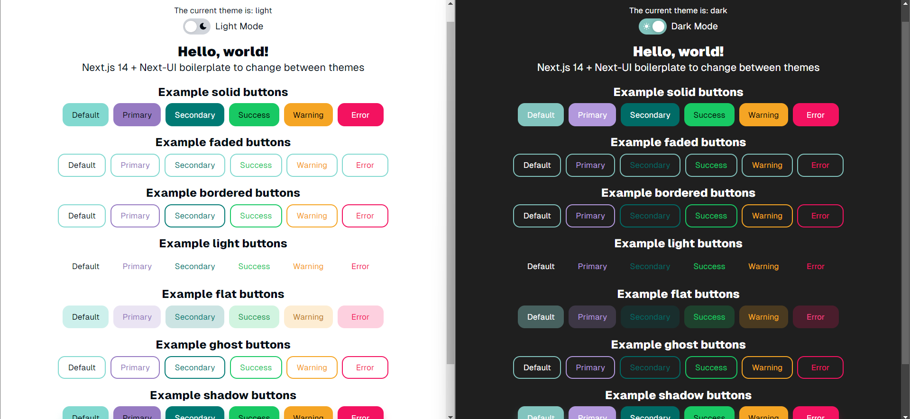

<div align="center">
  <h1 align="center">🚀 NextDashKit 🛠️</h1>
</div>

### Table of Contents

- [📢 What is NextDashKit?](#-what-is-nextdashkit)
- [⚙️ Usage](#%EF%B8%8F-usage)
- [⭐ Features](#-features)

## 📢 What is NextDashKit?

**NextDashKit** is a comprehensive starter kit designed for quick and efficient initiation of Next.js 14 projects. It integrates NextUI and Tabler Icons with Next-theme for easy theme switching, streamlining the initial setup for frontend projects.

<div align="center">
  </img>
</div>

## ⚙️ Usage

To start the development environment, use `yarn` and `yarn dev`:

```bash
yarn
yarn dev
```

Open [http://localhost:3000](http://localhost:3000) with your browser to see the result.

## ⭐ Features

✅ Seamless integration of Next.js 14, NextUI, and Tabler Icons

✅ Preconfigured Next-theme for quick theme switching

✅ Boilerplate setup for rapid frontend development

<br/>

<hr>

<div align="center">
    <span>Made with ❤️ by <b><a href="https://www.linkedin.com/in/jalvarezz13/">jalvarezz13</a></b></span>
    <br>
</div>
